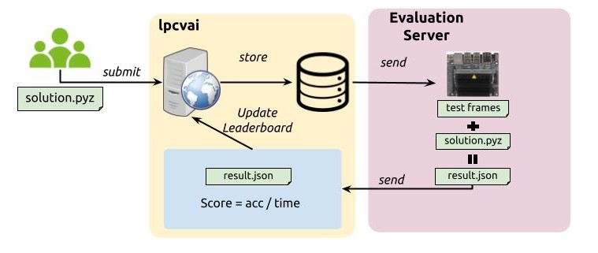

# 2023-LPCVC-Referee



### Setup
1. Clone this repository onto both server and nano
2. run setup.py on the nano
3. run pip install -r requirements.txt on the server
5. Create a referee.environment file in the root of the repository with the information:
```
WORKING_DIRECTORY=/path/to/referee #on server
LPCVC_QUEUE_DIR=/path/to/queue #on server
LPCVC_NANO_USER=username@hostname.local
LPCVC_NANO_PASSWORD=password
LPCVC_NANO_TEST_DIR=/path/to/referee #on nano
LPCVC_Test_Data=/path/to/test/data #on nano
LPCVC_SCORED_DIR=/path/to/successfully/scored/submissions #on server
LPCVC_FAILED_DIR=/path/to/failed/submissions  #on server
LPCVC_TIMED_OUT_DIR=/path/to/timed/out/submissions  #on server
LOG_FILE=/path/to/log/file #on server referee will generate a log file in this location
```
4. To run this in the background run ./server_code/startqueue.sh
5. If you want to make sure the job continues on reboot (in case of server crash) run `ansible-playbook configureCron.yml`
6. To remove the cron job run `ansible-playbook deleteCron.yml`

## How to kill the queue
To stop this script you can kill it by finding process id using `ps aux | grep -v grep | grep 'startscoring.py'` --- and then kill it with sudo kill ProcessID